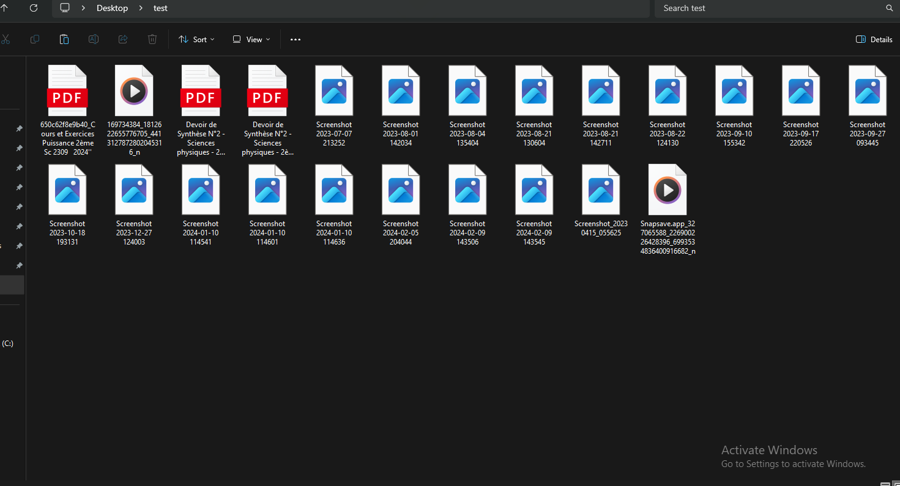
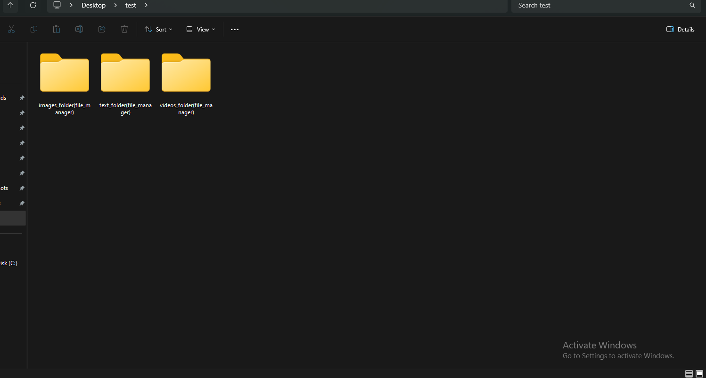

# File Manager

## Description
This script organizes files in a specified folder into subfolders based on their types.

## Tools Used
- Python 3
- os module
- shutil module

## Usage
1. Run the script.
2. Enter the folder name when prompted or pass it as an argument.

## Before and After
### Before

### After

## To-Do List
- [ ] Remove duplicate files
- [ ] Handle other file types (add more categories)
- [ ] Add logging functionality
- [ ] Improve error handling
- [ ] Add support for additional command-line options
